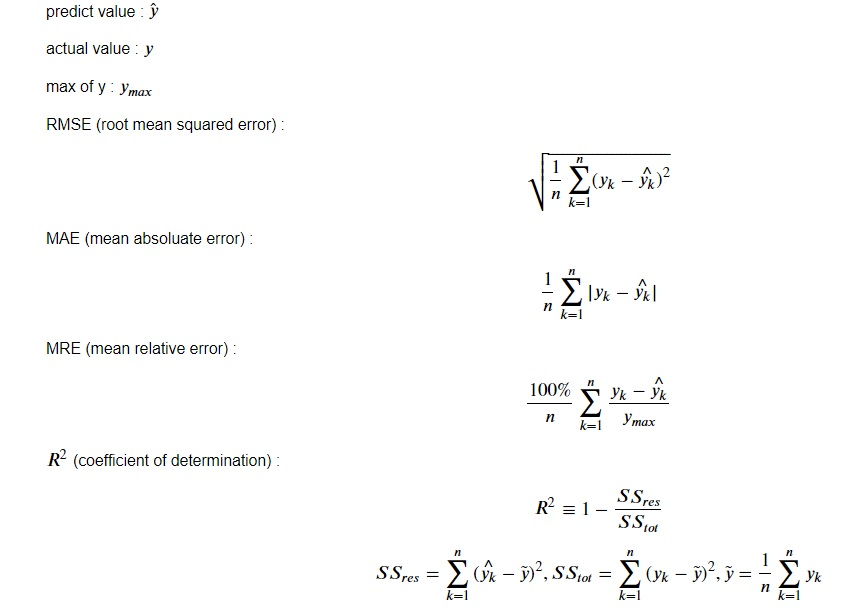

# Introduction
In the future, solar energy will be the main power supply. Solar energy is non-dispatchable source. Ensuring grid stability , PV forecast is the problem. I will try to solve problem with machine learning.      

Question : predicet next hour energy .

# Data Info
Data source: Taichung DE PV Plant, CWB WUQI weather data.

Period: 2016/01/01 - 2017/12/31

Frequency : 1 hour.

Power data :
             
                 power(KWH) : PV plant produce energy ( 𝐾𝑊𝐻 ).

                 Solar Irradiance : power per unit area received from the sun ( 𝐾𝐽/𝑚2 )

Weather data :
                
                StnPres : station pressure ( ℎ𝑃𝑎 ).

                SeaPres : sea surface pressure ( ℎ𝑃𝑎 ).

                Temperature : temperature ( ∘𝐶 ).

                Td dew point : dew point temperature( ∘𝐶 ).

                RH : relative humidity ( % ).

                WS : wind speed( 𝑚/𝑠 ).

                WD : wind direction ( ∘ ).

                WSGust : the maximum gust wind speed( 𝑚/𝑠 ).

                WDGust : the maximum gust wind direction ( ∘ ).

                Precp : precipitation ( 𝑚𝑚 ).

                PrecpHour : precipitation duration( 𝐻𝑜𝑢𝑟 ).

                SunShine : sunshine duration( 𝐻𝑜𝑢𝑟 ).

                GlobRad : global radiation( 𝑀𝐽/𝑚2 ).

                Visb : visibility.

                UVI : This station can't collect UVI.

                Cloud Amount : refers to the fraction of the sky obscured by clouds.
 
 [power data processing](https://github.com/Eudyptla/Time-Series-PV-Forecast-/blob/main/Manipulating_Taichung_DE_Power_and_Solar_Irradiance.ipynb)
 
 [weather data processing](https://github.com/Eudyptla/Time-Series-PV-Forecast-/blob/main/Manipulating_WUQI_Weather_and_Merge_Power_Data.ipynb)
               
# Experiment with 5 different models:

[SARIMA](https://github.com/Eudyptla/Time-Series-PV-Forecast-/blob/main/TaiChung_DE_Forecast_SARIMA.ipynb)

[SVR](https://github.com/Eudyptla/Time-Series-PV-Forecast-/blob/main/TaiChung_DE_Forecast_SVR.ipynb)

[Xgboost](https://github.com/Eudyptla/Time-Series-PV-Forecast-/blob/main/Taichung_DE_PV_Forecast_Xgboost.ipynb)

[Neural Network](https://github.com/Eudyptla/Time-Series-PV-Forecast-/blob/main/Taichung_DE_Forecast_Neural_network.ipynb)

[LSTM](https://github.com/Eudyptla/Time-Series-PV-Forecast-/blob/main/Taichung_DE_PV_Forecast_LSTM.ipynb) 

# Model Score 

Score   | SARIMA    | SVR       | Xgboost   | Neural Network| LSTM
--------|:---------:|:---------:|:---------:|:---------:    |:--------:
RMSE    | 101.0158  |  90.5111  | 98.5680   | 98.3961       |85.7867
MAE     | 47.0276   |  41.3922  |  46.5779  | 56.2184       |38.3409
MRE     | 3.28%     | 2.88%     |  3.25%    | 3.92%         |2.67%
$R^{2}$ | 0.9002    | 0.9338    |  0.9215   | 0.9218        |0.9406

